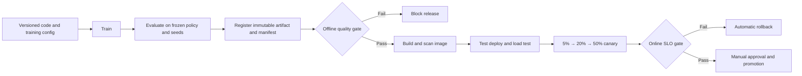

# pw2048 — Play 2048 with Algorithms

An automation-first **2048 benchmark and experimentation platform** for comparing search and reinforcement learning algorithms with reproducible evaluation, reporting, and developer-friendly workflows.

`pw2048` uses the 2048 game as a compact benchmark environment, but its real value goes beyond “building a game bot”.
It is designed as a small engineering system for:

- algorithm comparison
- experiment automation
- reproducible evaluation
- report generation
- training / benchmark workflow design
- multi-interface developer experience (CLI / TUI / Web)

## Five-minute tour

If you only have five minutes, read the project in this order:

1. **Problem** — AI experiments are easy to run once, but difficult to compare,
   reproduce, release and operate safely.
2. **Approach** — pw2048 uses a small deterministic domain to connect
   `Env → Train → Eval → Registry → Quality Gate → Deploy → Observe → Rollback`.
3. **Evidence** — models carry immutable manifests; candidates must pass offline
   quality checks; services pass load and canary gates before promotion.
4. **Operations** — Stable/Canary workloads expose metrics and traces, run in
   isolated Kubernetes environments, and support automated rollback.
5. **Boundary** — this is an engineering reference implementation, not a claim
   that reinforcement learning beats Expectimax or that a demo equals a large
   production cluster.

The shortest guided path is:

- [System Architecture](docs/architecture.md)
- [Model Release Demo](docs/demo-model-release.md)
- [Canary Failure and Rollback Demo](docs/demo-canary-rollback.md)
- [Capacity Report Example](docs/examples/capacity-plan.md)
- [Rejected Model Example](docs/demo-quality-regression.md)
- [Design Trade-offs](docs/design-tradeoffs.md)
- [3-minute and 10-minute Project Introductions](docs/interview-presentation.md)

### End-to-end lifecycle



## Screenshots

| 2048 Game | Web Launcher |
|:---------:|:------------:|
|  |  |


## Why this exists

A lot of AI side projects stop at one of these stages:

- “the algorithm works”
- “the demo looks cool”
- “the model trained once”

That is not enough if the goal is to build something reusable, comparable, and explainable.

`pw2048` was created to treat experimentation as an engineering problem:

- How do you benchmark multiple strategies fairly?
- How do you keep evaluation reproducible?
- How do you compare search algorithms and RL agents in one workflow?
- How do you generate outputs that are useful beyond a one-off run?

This makes `pw2048` closer to an **experiment infrastructure / evaluation tooling project** than a simple game automation demo.

---

## What it demonstrates

Although the benchmark environment is 2048, the project demonstrates a broader set of engineering capabilities:

- browser automation with Playwright
- benchmark workflow design
- reproducible metric collection
- RL training / evaluation loop design
- HTML report generation and visualization
- experiment ergonomics through CLI / TUI / Web interfaces
- structured project architecture for iterative algorithm work

A better way to read this repository is:

- **Benchmark Platform**
- **Experiment Automation Tooling**
- **Reproducible Evaluation Workflow**
- **AI-Enhanced Engineering Tooling**

not simply:

- a 2048 bot
- a hobby RL experiment
- a game-only side project

## At a Glance

| Field | Value |
|---|---|
| **Current best measured algorithm** | Expectimax |
| **Highest historical avg score** | ~33 000 (Expectimax, 73% win rate) |
| **Learning algorithms** | DQN-v3 / PPO-v3; currently below the strongest search baseline |
| **Recommended benchmark protocol** | frozen policy, fixed seeds, 5 runs × 500 games |

--- 

## Current scope

`pw2048` currently supports:

### Search-based strategies
- Random
- Greedy
- Heuristic
- Expectimax
- MCTS

### Learning-based strategies
- DQN (multiple versions)
- PPO (multiple versions)
- behavioural-cloning pre-training variants

### Engineering support layers
- benchmark execution
- training/evaluation split
- visualization
- leaderboard generation
- CLI/TUI/Web launch paths
- TensorBoard-compatible logging

---

## Why this matters beyond 2048

The most important part of this repository is not the game itself.

What matters is the structure:

- a controlled environment
- multiple comparable strategies
- repeatable evaluation loops
- automated result reporting
- an interface layer that makes the system easier to use

That structure is reusable far beyond 2048.

The same engineering pattern can be adapted to:

- agent benchmarking
- browser-based task evaluation
- policy comparison experiments
- lightweight AI test harnesses
- internal experimentation platforms for model or strategy iteration

---

## Current Leaderboard

> Run `python main.py --mode benchmark --report` to populate this table.

| Rank | Algorithm | Version | Avg Score | P90 | Max Score | Best Tile | Win Rate |
|---:|---|---|---:|---:|---:|---:|---:|
| 1 | Expectimax | v1 | 33 030 | 60 266 | 132 412 | 8192 | 73.4% |
| 2 | Heuristic | v1 | 16 061 | 28 185 | 61 064 | 4096 | 21.6% |
| 3 | MCTS | v2 | 7 821 | 12 649 | 15 416 | 1024 | 0.0% |
| 4 | Greedy | v1 | 3 050 | 5 416 | 13 820 | 1024 | 0.0% |
| 5 | Random | v1 | 1 102 | 1 720 | 3 324 | 256 | 0.0% |
| 6 | DQN-v3* | v3 | — | — | — | — | — |
| 7 | PPO-v3* | v3 | — | — | — | — | — |

\* DQN-v3 / PPO-v3 include behavioural-cloning pre-training.
See **[RL Training Guide →](docs/rl-training.md)** to push their scores higher.

### How to interpret the leaderboard

The project does **not** assume that a neural policy must beat a non-learning
algorithm. 2048 has a compact, known transition model, so Expectimax can search
future moves directly and is a strong baseline. A small DQN or PPO policy must
learn comparable structure from data and may remain worse under a limited
training budget.

The current RL implementation should therefore be read as an honest experiment,
not as evidence that adding a model automatically improves the score. Its value
is that the same environment, metrics, checkpoints and reports can expose when
learning helps, when it does not, and why.

Benchmark runs are inference-only: DQN uses greedy Q-values and PPO uses the
highest-logit valid action. Exploration, replay-buffer writes and weight updates
are disabled. Learning checkpoints are evaluated sequentially because creating
fresh parallel workers would silently discard their loaded weights. Historical
numbers above predate this stricter protocol and should be treated as
illustrative until regenerated with frozen policies and matched seed sets.

## Quick start

```bash
# Install dependencies
pip install -r requirements.txt
python -m playwright install chromium

# Run 20 games with the random algorithm (default)
python main.py

# Run with the TUI wizard (arrow-key menus)
python main.py --tui

# Run with the web UI wizard (browser form)
python main.py --web

# Full benchmark with HTML leaderboard
python main.py --mode benchmark --report

# Fast in-process RL training (no browser, 10–50× faster)
python main.py --algorithm dqn \
               --train-games 5000 \
               --checkpoint-dir checkpoints \
               --tensorboard-dir tb_logs

# Auto-training: train until performance plateaus (no need to guess game count)
python main.py --algorithm dqn \
               --early-stopping-patience 10 \
               --eval-freq 50 \
               --checkpoint-dir checkpoints \
               --games 0

# Maximum speed: GPU + 4 parallel workers + early stopping
python main.py --algorithm dqn \
               --train-workers 4 \
               --early-stopping-patience 15 \
               --eval-freq 100 \
               --checkpoint-dir checkpoints \
               --tensorboard-dir tb_logs \
               --games 0

# Inspect model status after training
python main.py --inspect-checkpoint checkpoints/DQN-v3/best_checkpoint.npz
python main.py --training-status    tb_logs/DQN-v3
```

## Production-shaped canary deployment

The repository includes a versioned inference API and a complete Kubernetes
canary workflow: stable/canary Deployments, weighted NGINX routing, sticky test
sessions, health probes, Prometheus metrics, progressive traffic steps,
automatic metric gates, promotion, and rollback.

See **[Canary Deployment Guide](docs/canary-deployment.md)**.

### AI engineering lifecycle

The production example covers the full path from reproducible training
metadata to controlled operation:

1. immutable model manifests and a pluggable registry;
2. stable/candidate offline quality gates;
3. GitLab CI test, scan, deploy, load-test, canary and approval stages;
4. Prometheus metrics, Grafana dashboard, alerts, SLOs and OpenTelemetry spans;
5. k6 load tests and an automated N+1 capacity plan;
6. Kustomize-separated Dev/Test/Demo/Prod environments and production policy;
7. model pre-warm, rate/concurrency limits, backpressure and deadlines;
8. fault injection, rollback verification and an incident runbook.

Start with the [Model Lifecycle](docs/model-lifecycle.md),
[Capacity Planning](docs/capacity-planning.md),
[Production Kubernetes](docs/kubernetes-production.md),
[Observability](docs/observability.md), and
[Incident Runbook](docs/incident-runbook.md) guides.

## 4-layer RL Training Pipeline

The system exposes a structured Env / Train / Eval / Play stack for sustained
high-score improvement:

| Layer | Module | Description |
|---|---|---|
| **Env** | `src/rl_env.py` → `Game2048Env` | Pure-Python gym-style env, no browser, 10–50× faster |
| **Train** | `src/rl_trainer.py` → `RLTrainer` | In-process training loop; drives `choose_move()` |
| **Eval** | `src/rl_trainer.py` → `EvalCallback` | Greedy eval every N games; saves `best_checkpoint.npz` |
| **Play** | `src/runner.py` | Playwright browser benchmark / demo |

```bash
# Train, then benchmark
python main.py --algorithm dqn \
               --train-games 5000 --checkpoint-dir checkpoints \
               --tensorboard-dir tb_logs --eval-freq 50 --n-eval-games 20

python main.py --algorithm dqn --games 50 --checkpoint-dir checkpoints --report

tensorboard --logdir tb_logs   # view training curves

# Auto-training (early stopping) — stops when score plateaus
python main.py --algorithm dqn \
               --early-stopping-patience 10 --eval-freq 50 \
               --checkpoint-dir checkpoints --games 0
```

→ **[Full RL Training Guide](docs/rl-training.md)**  
→ **[Efficient Training Playbook — GPU / Parallel / Status](docs/efficient-training.md)**

## Roadmap

### Baselines
- [x] **Random** — pick a random direction each turn
- [x] **Greedy** — pick the move that maximises immediate score gain
- [x] **Heuristic** — hand-crafted heuristics (corner strategy, monotonicity, empty tiles, merge potential)

### Search Algorithms
- [x] **Expectimax** — game-tree search with chance nodes for tile spawns
- [x] **MCTS** — Monte Carlo Tree Search (v1: random rollout, v2: greedy rollout)

### Learning Algorithms
- [x] **DQN v1/v2/v3** — v3 adds BC pre-training, Adam, one-hot encoding, score reward
- [x] **PPO v1/v2/v3** — v3 adds BC pre-training, Adam, one-hot encoding, score reward
- [x] **4-layer Env/Train/Eval/Play** — in-process training, EvalCallback, TensorBoard
- [x] **Early stopping** — auto-stop when score plateaus (`--early-stopping-patience`)
- [x] **GPU acceleration** — optional PyTorch backend (Apple MPS / CUDA)
- [x] **Parallel training** — N independent workers, best model selected (`--train-workers`)

## Project structure

```
pw2048/
├── game.html                  # Self-contained 2048 game (served locally)
├── main.py                    # CLI entry-point
├── requirements.txt
├── docs/                      # Detailed documentation
│   ├── rl-training.md         # RL guide: checkpoints, 4-layer pipeline, TensorBoard
│   ├── cli-reference.md       # All CLI flags, modes, result layout
│   └── ui-wizards.md          # TUI / GUI / Web UI usage
├── src/
│   ├── game.py                # Playwright wrapper
│   ├── runner.py              # Play layer: browser runner (sequential / parallel)
│   ├── rl_env.py              # Env layer: Game2048Env
│   ├── rl_trainer.py          # Train + Eval layers: RLTrainer, EvalCallback, TrainingLogger
│   ├── visualize.py           # Matplotlib charts
│   ├── report.py              # HTML dashboard generator
│   ├── storage.py             # S3 upload / prune helpers
│   ├── tui.py                 # TUI wizard (questionary + rich)
│   ├── gui.py                 # Desktop GUI wizard (tkinter)
│   ├── webui.py               # Web UI launcher (http.server)
│   └── algorithms/
│       ├── base.py
│       ├── random_algo.py
│       ├── greedy_algo.py
│       ├── heuristic_algo.py
│       ├── expectimax_algo.py
│       ├── mcts_algo.py
│       ├── dqn_algo.py        # DQN v1/v2/v3
│       └── ppo_algo.py        # PPO v1/v2/v3
└── tests/
    ├── test_game_and_algorithms.py
    ├── test_rl_env_and_trainer.py
    ├── test_storage_and_report.py
    ├── test_tui.py
    ├── test_gui.py
    └── test_webui.py
```

## Running tests

```bash
python -m pytest tests/ -v
```

---

## Engineering value of this repository

This repository is useful as a technical project because it shows more than raw algorithm experimentation.
It also shows:

- how to build an evaluation workflow around algorithms
- how to separate training, evaluation, and play layers
- how to automate result collection and reporting
- how to make an experimentation system easier to operate
- how to turn a benchmark setup into a reusable engineering asset

That is the main reason `pw2048` belongs in a broader professional narrative around:

- automation
- tooling
- experiment infrastructure
- AI-enhanced engineering systems

---

## Recommended way to present this repo professionally

If you are using this repository in a portfolio, README, or career narrative, the most useful framing is:

> Built an automation-first benchmark platform for comparing search and RL algorithms, with reproducible evaluation, structured reporting, and multiple user interaction layers.

That framing is stronger than:

> I made an AI project that plays 2048.

Because it points attention to the engineering system, not just the toy surface.

---

## Further reading

| Topic | Doc |
|---|---|
| Getting high scores with RL, checkpoints, TensorBoard | **[docs/rl-training.md](docs/rl-training.md)** |
| **GPU acceleration, parallel workers, early stopping, model status** | **[docs/efficient-training.md](docs/efficient-training.md)** |
| All CLI flags, parallel mode, result layout | **[docs/cli-reference.md](docs/cli-reference.md)** |
| TUI / GUI / Web UI wizards | **[docs/ui-wizards.md](docs/ui-wizards.md)** |

---

## Summary

`pw2048` is an experiment platform built around 2048, but its real contribution is in the surrounding engineering system:
benchmark design, experiment automation, evaluation workflows, and report generation.

That is what makes it more than a game project — and closer to a reusable AI engineering asset.
