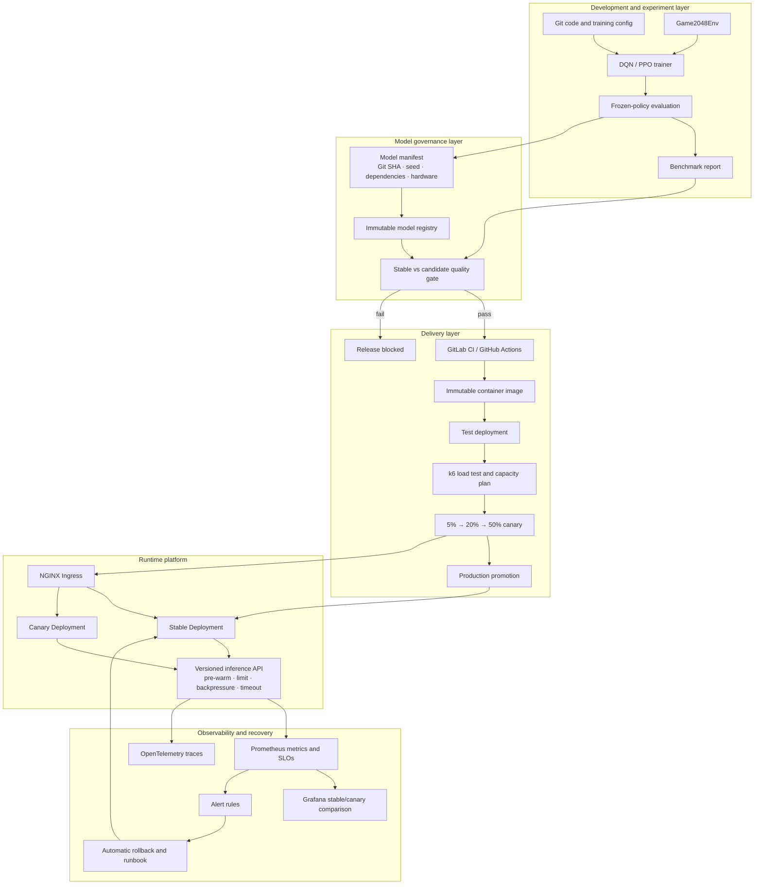

# System architecture

pw2048 is an AI engineering reference system built around a deliberately small
problem domain. The goal is to make every transition—from experiment to
production—observable, reproducible and reversible.

## Complete architecture

## Responsibility boundaries

| Layer | Owns | Does not own |
|---|---|---|
| Training | Learning loop, checkpoint and seed | Production traffic |
| Evaluation | Frozen policy, matched seeds and quality metrics | Service availability |
| Registry | Artifact integrity and provenance | Deciding whether quality is acceptable |
| CI/CD | Repeatable gates and immutable delivery | Inventing missing business thresholds |
| Runtime | Admission, inference and version reporting | Retraining the model |
| Observability | Metrics, traces, alerts and evidence | Silently changing production state |

## Mapping to ASR/TTS

The engineering structure is reusable, while domain metrics change:

| pw2048 | ASR/TTS equivalent |
|---|---|
| Mean/P90 score and win rate | CER/WER, MOS or task-success quality |
| Single-board inference | Streaming audio session or synthesis request |
| CPU concurrency | GPU memory, batch size and active streams |
| HTTP request latency | First-token/first-audio latency, tail latency and RTF |
| Algorithm version | Acoustic/language/vocoder or personalized model version |

The project therefore demonstrates lifecycle engineering, not ASR/TTS algorithm
expertise.
